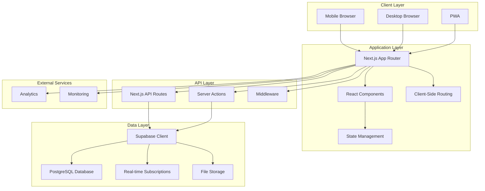
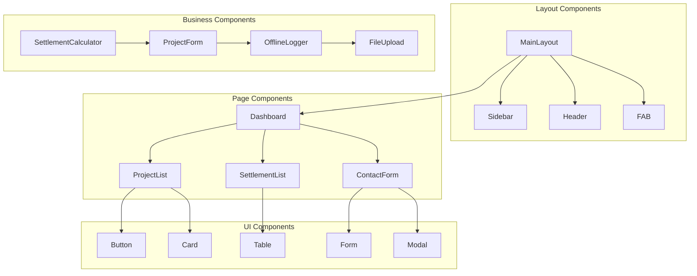
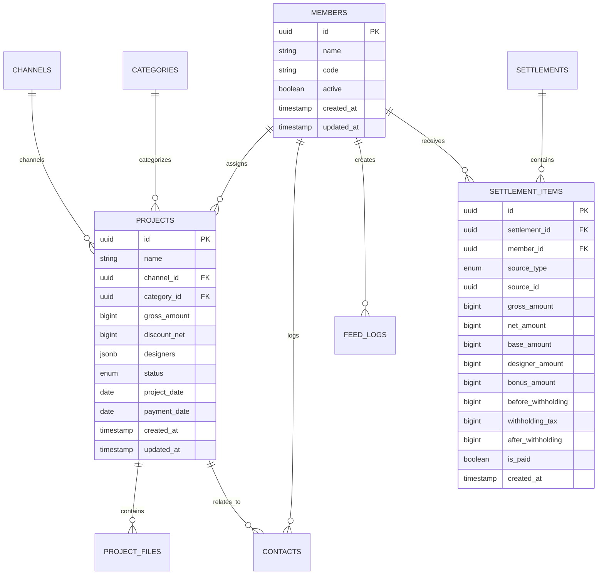
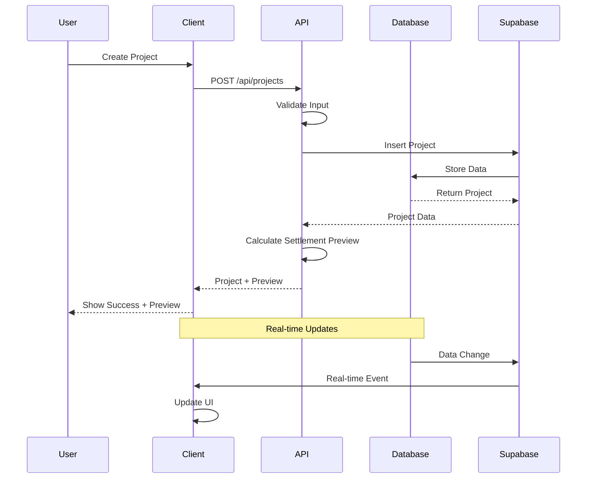
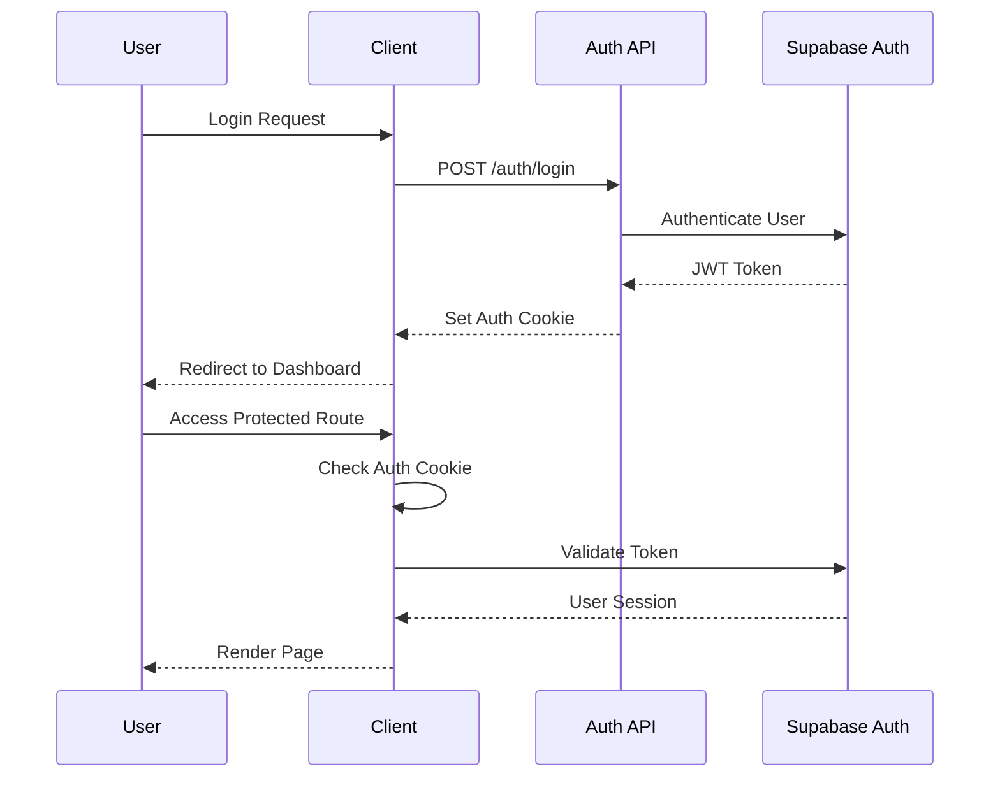

# MZS Settlement System - System Architecture

## 📋 Overview

The MZS Settlement System is designed as a modern, scalable web application for managing designer settlements in a mobile-first environment. This document provides a comprehensive overview of the system architecture, design decisions, and technical implementation details.

## 🏗️ High-Level Architecture



## 🎯 Architecture Principles

### 1. **Mobile-First Design**
- Responsive design with mobile as the primary target
- Progressive Web App (PWA) capabilities
- Offline-first functionality for critical features
- Touch-optimized interactions

### 2. **Type Safety**
- End-to-end TypeScript implementation
- Database schema types auto-generated from Supabase
- Runtime validation with Zod schemas
- Compile-time error prevention

### 3. **Performance Optimization**
- Server-side rendering (SSR) with Next.js App Router
- Client-side caching with TanStack Query
- Image optimization and lazy loading
- Code splitting and bundle optimization

### 4. **Scalability**
- Serverless architecture with Vercel/Next.js
- Database scaling with Supabase PostgreSQL
- CDN distribution for static assets
- Horizontal scaling capabilities

### 5. **Security First**
- Row Level Security (RLS) in database
- Type-safe API endpoints
- Input validation and sanitization
- HTTPS enforcement

## 🏛️ System Components

### Frontend Architecture

#### 1. **Next.js App Router Structure**
```
src/app/
├── (auth)/                 # Authentication routes
├── (dashboard)/           # Main application routes
│   ├── page.tsx          # Dashboard
│   ├── projects/         # Project management
│   ├── settlements/      # Settlement management
│   ├── contacts/         # Contact logging
│   ├── feed/            # Feed management
│   ├── team/            # Team tasks
│   ├── funds/           # Fund management
│   └── settings/        # System settings
├── api/                 # API routes
│   ├── projects/        # Project endpoints
│   ├── settlements/     # Settlement endpoints
│   └── supporting-data/ # Master data endpoints
├── globals.css          # Global styles
├── layout.tsx          # Root layout
└── loading.tsx         # Loading components
```

#### 2. **Component Architecture**



#### 3. **State Management Architecture**

```typescript
// Global State with TanStack Query
export const queryClient = new QueryClient({
  defaultOptions: {
    queries: {
      staleTime: 5 * 60 * 1000, // 5 minutes
      gcTime: 10 * 60 * 1000,   // 10 minutes
      retry: 3,
      refetchOnWindowFocus: false,
    },
  },
})

// Local State with React Hooks
const useProjectForm = () => {
  const [formData, setFormData] = useState(initialState)
  const [errors, setErrors] = useState({})
  // ... form logic
}

// Offline State with localStorage
const useOfflineLogger = () => {
  const [offlineActions, setOfflineActions] = useLocalStorage('offline-actions', [])
  // ... offline logic
}
```

### Backend Architecture

#### 1. **API Route Structure**

```
src/app/api/
├── projects/
│   ├── route.ts          # GET /api/projects, POST /api/projects
│   ├── [id]/
│   │   └── route.ts      # GET, PUT, DELETE /api/projects/[id]
│   ├── batch/
│   │   └── route.ts      # POST /api/projects/batch
│   └── stats/
│       └── route.ts      # GET /api/projects/stats
├── settlements/
│   ├── route.ts          # GET, POST /api/settlements
│   ├── [id]/
│   │   └── route.ts      # GET, PUT, DELETE /api/settlements/[id]
│   └── generate/
│       └── route.ts      # POST /api/settlements/generate
└── supporting-data/
    └── route.ts          # GET /api/supporting-data
```

#### 2. **Business Logic Layer**

```typescript
// Settlement Calculation Engine
export class SettlementCalculator {
  // Core calculation methods
  calculateNetFromGross(grossAmount: number): number
  calculateProjectFees(netAmount: number, channelFeeRate: number): FeeCalculation
  calculateDesignerSettlement(baseAmount: number, designerPercent: number, bonusPct: number): SettlementCalculation

  // Complex calculations
  calculateProjectSettlement(grossAmount: number, discountNet: number, designers: DesignerAllocation[]): CompleteSettlementCalculation

  // Validation methods
  validateDesignerPercentages(designers: DesignerAllocation[]): SettlementValidation
  validateProjectAmounts(grossAmount: number, discountNet: number): ValidationResult
}

// API Client Layer
export class ApiClient {
  // CRUD operations
  async createProject(data: CreateProjectForm): Promise<Project>
  async updateProject(id: string, data: UpdateProjectForm): Promise<Project>
  async deleteProject(id: string): Promise<void>

  // Business operations
  async generateSettlement(month: string): Promise<Settlement>
  async calculatePreview(projectData: ProjectFormData): Promise<SettlementPreview>
}
```

### Database Architecture

#### 1. **Database Schema Overview**



#### 2. **Key Database Features**

**Row Level Security (RLS)**
```sql
-- Enable RLS on all tables
ALTER TABLE members ENABLE ROW LEVEL SECURITY;
ALTER TABLE projects ENABLE ROW LEVEL SECURITY;
ALTER TABLE settlements ENABLE ROW LEVEL SECURITY;

-- Example policy for members table
CREATE POLICY "Members are viewable by everyone" ON members
FOR SELECT USING (true);

CREATE POLICY "Only authenticated users can modify members" ON members
FOR ALL USING (auth.role() = 'authenticated');
```

**Database Functions**
```sql
-- Settlement calculation function
CREATE OR REPLACE FUNCTION calculate_settlement_amount(
  gross_amount_param numeric,
  discount_net_param numeric DEFAULT 0,
  designer_percent_param numeric DEFAULT 100,
  bonus_pct_param numeric DEFAULT 0
) RETURNS TABLE(
  gross_t numeric,
  net_b numeric,
  designer_amount numeric,
  bonus_amount numeric,
  before_withholding numeric,
  withholding_tax numeric,
  after_withholding numeric
) AS $$
BEGIN
  -- Implementation of settlement calculation logic
  RETURN QUERY
  SELECT
    gross_amount_param,
    round(gross_amount_param / 1.1),
    -- ... calculation logic
END;
$$ LANGUAGE plpgsql;
```

**Database Views**
```sql
-- Monthly member summary view
CREATE VIEW monthly_member_summary AS
SELECT
  m.id as member_id,
  m.name as member_name,
  m.code as member_code,
  DATE_TRUNC('month', si.created_at) as month,
  COUNT(DISTINCT p.id) as project_count,
  COUNT(DISTINCT c.id) as contact_count,
  COUNT(DISTINCT fl.id) as feed_count,
  SUM(si.before_withholding) as total_before_withholding,
  SUM(si.withholding_tax) as total_withholding_tax,
  SUM(si.after_withholding) as total_after_withholding
FROM members m
LEFT JOIN settlement_items si ON m.id = si.member_id
LEFT JOIN projects p ON m.id = ANY(p.designers)
LEFT JOIN contacts c ON m.id = c.member_id
LEFT JOIN feed_logs fl ON m.id = fl.member_id
GROUP BY m.id, m.name, m.code, DATE_TRUNC('month', si.created_at);
```

#### 3. **Data Flow Architecture**



## 🔧 Technical Implementation Details

### 1. **Settlement Calculation Engine**

The core business logic is implemented in `src/lib/settlement-calculations.ts`:

```typescript
export const SETTLEMENT_RULES = {
  VAT_RATE: 0.10,              // 10% VAT
  DESIGNER_BASE_RATE: 0.40,    // 40% goes to designers
  WITHHOLDING_TAX_RATE: 0.033, // 3.3% withholding tax
  AD_FEE_RATE: 0.10,           // 10% advertising fee
  PROGRAM_FEE_RATE: 0.03,      // 3% program fee

  CONTACT_AMOUNTS: {
    INCOMING: 1000,
    CHAT: 1000,
    GUIDE: 2000,
  },

  FEED_AMOUNTS: {
    BELOW3: 400,
    GTE3: 1000,
  },
} as const

// Core calculation flow:
// T (gross with VAT) → B (net) = T / 1.1
// base = B + discount_net
// designer_amount = base × 0.40 × designer_percent
// bonus_amount = designer_amount × bonus_pct
// before_withholding = designer_amount + bonus_amount
// withholding_tax = before_withholding × 0.033
// after_withholding = before_withholding - withholding_tax
```

### 2. **Real-time Features**

```typescript
// Real-time subscription setup
export function useRealtimeProjects() {
  const queryClient = useQueryClient()

  useEffect(() => {
    const channel = supabase
      .channel('projects')
      .on('postgres_changes',
        { event: '*', schema: 'public', table: 'projects' },
        (payload) => {
          queryClient.invalidateQueries({ queryKey: ['projects'] })
        }
      )
      .subscribe()

    return () => {
      supabase.removeChannel(channel)
    }
  }, [queryClient])
}
```

### 3. **Offline Functionality**

```typescript
// Offline action queue
export const useOfflineLogger = () => {
  const [offlineActions, setOfflineActions] = useLocalStorage<OfflineAction[]>('offline-actions', [])
  const [isOnline, setIsOnline] = useState(navigator.onLine)

  const addOfflineAction = useCallback((action: OfflineAction) => {
    if (!isOnline) {
      setOfflineActions(prev => [...prev, { ...action, timestamp: Date.now() }])
    }
  }, [isOnline, setOfflineActions])

  const syncOfflineActions = useCallback(async () => {
    if (isOnline && offlineActions.length > 0) {
      for (const action of offlineActions) {
        try {
          await processOfflineAction(action)
        } catch (error) {
          console.error('Failed to sync offline action:', error)
        }
      }
      setOfflineActions([])
    }
  }, [isOnline, offlineActions, setOfflineActions])

  return { addOfflineAction, syncOfflineActions, isOnline, offlineActions }
}
```

### 4. **File Upload Architecture**

```typescript
// File upload with Supabase Storage
export async function uploadProjectFile(projectId: string, file: File): Promise<string> {
  const fileExt = file.name.split('.').pop()
  const fileName = `${Date.now()}.${fileExt}`
  const filePath = `project-files/${projectId}/${fileName}`

  const { data, error } = await supabase.storage
    .from('project-files')
    .upload(filePath, file, {
      cacheControl: '3600',
      upsert: false
    })

  if (error) throw error

  // Save file record to database
  await supabase
    .from('project_files')
    .insert({
      project_id: projectId,
      file_name: file.name,
      file_path: data.path,
      file_size: file.size,
      file_type: file.type,
    })

  return data.path
}
```

## 🔐 Security Architecture

### 1. **Authentication Flow**



### 2. **Data Access Control**

```typescript
// Row Level Security Example
CREATE POLICY "Users can only see their own settlement items" ON settlement_items
FOR SELECT USING (
  member_id IN (
    SELECT id FROM members
    WHERE auth.uid()::text = id::text
  )
);

// API Route Protection
export async function GET(request: Request) {
  const supabase = createClient()
  const { data: { user }, error } = await supabase.auth.getUser()

  if (error || !user) {
    return NextResponse.json({ error: 'Unauthorized' }, { status: 401 })
  }

  // Continue with protected logic
}
```

### 3. **Input Validation**

```typescript
// Zod schemas for validation
export const CreateProjectSchema = z.object({
  name: z.string().min(1, '프로젝트명은 필수입니다'),
  channel_id: z.string().uuid('올바른 채널을 선택하세요'),
  category_id: z.string().uuid().optional(),
  gross_amount: z.number().positive('금액은 0보다 커야 합니다'),
  discount_net: z.number().min(0, '할인금액은 음수일 수 없습니다').optional(),
  designers: z.array(DesignerAllocationSchema).min(1, '최소 한 명의 디자이너가 필요합니다'),
  project_date: z.string().datetime().optional(),
  payment_date: z.string().datetime().optional(),
  notes: z.string().optional(),
})

// API validation
export async function POST(request: Request) {
  try {
    const body = await request.json()
    const validatedData = CreateProjectSchema.parse(body)
    // Continue with validated data
  } catch (error) {
    if (error instanceof z.ZodError) {
      return NextResponse.json({
        error: 'Validation failed',
        details: error.errors
      }, { status: 400 })
    }
  }
}
```

## 📱 Mobile-First Architecture

### 1. **Responsive Design System**

```typescript
// Tailwind breakpoint system
const breakpoints = {
  sm: '640px',   // Mobile landscape
  md: '768px',   // Tablet
  lg: '1024px',  // Desktop
  xl: '1280px',  // Large desktop
  '2xl': '1536px' // Extra large
}

// Component responsive design
export function ProjectCard({ project }: { project: Project }) {
  return (
    <Card className="
      w-full
      p-4 sm:p-6
      mb-4 sm:mb-6
      grid grid-cols-1 sm:grid-cols-2 lg:grid-cols-3
      gap-4 sm:gap-6
    ">
      {/* Card content */}
    </Card>
  )
}
```

### 2. **PWA Configuration**

```typescript
// next.config.js
const withPWA = require('@ducanh2912/next-pwa').default({
  dest: 'public',
  cacheOnFrontEndNav: true,
  aggressiveFrontEndNavCaching: true,
  reloadOnOnline: true,
  swcMinify: true,
  disable: process.env.NODE_ENV === 'development',
  workboxOptions: {
    disableDevLogs: true,
  },
})

module.exports = withPWA({
  // Next.js config
})

// manifest.json
{
  "name": "MZS Settlement System",
  "short_name": "MZS Settlement",
  "description": "모바일 우선 디자인 스튜디오 정산 관리 플랫폼",
  "start_url": "/",
  "display": "standalone",
  "background_color": "#ffffff",
  "theme_color": "#f68b1f",
  "icons": [
    {
      "src": "/icon-192x192.png",
      "sizes": "192x192",
      "type": "image/png"
    },
    {
      "src": "/icon-512x512.png",
      "sizes": "512x512",
      "type": "image/png"
    }
  ]
}
```

### 3. **FAB (Floating Action Button) Architecture**

```typescript
// FAB Component for mobile quick actions
export function FloatingActionButton() {
  const [isOpen, setIsOpen] = useState(false)
  const { addOfflineAction, isOnline } = useOfflineLogger()

  const handleQuickAction = async (action: QuickAction) => {
    if (isOnline) {
      await processAction(action)
    } else {
      addOfflineAction(action)
      toast.success('오프라인 상태입니다. 온라인 시 자동 동기화됩니다.')
    }
  }

  return (
    <AnimatePresence>
      <motion.div
        className="fixed bottom-6 right-6 z-50 md:hidden"
        initial={{ scale: 0 }}
        animate={{ scale: 1 }}
        exit={{ scale: 0 }}
      >
        <FABMenu
          isOpen={isOpen}
          onToggle={() => setIsOpen(!isOpen)}
          onAction={handleQuickAction}
          actions={QUICK_ACTIONS}
        />
      </motion.div>
    </AnimatePresence>
  )
}
```

## 🎨 UI/UX Architecture

### 1. **Design System**

```typescript
// Design tokens
export const designTokens = {
  colors: {
    primary: '#f68b1f',      // Orange accent
    background: '#ffffff',    // White background
    secondary: '#f5f5f5',    // Light gray
    text: '#1f2937',         // Dark gray
    muted: '#6b7280',        // Medium gray
  },

  spacing: {
    xs: '0.25rem',   // 4px
    sm: '0.5rem',    // 8px
    md: '1rem',      // 16px
    lg: '1.5rem',    // 24px
    xl: '2rem',      // 32px
  },

  borderRadius: {
    sm: '0.5rem',    // 8px
    md: '1rem',      // 16px
    lg: '1.5rem',    // 24px
    xl: '2rem',      // 32px - main rounded style
  },

  typography: {
    h1: 'text-3xl font-bold',
    h2: 'text-2xl font-semibold',
    h3: 'text-xl font-medium',
    body: 'text-base',
    caption: 'text-sm text-muted-foreground',
  }
} as const
```

### 2. **Component Library Structure**

```
src/components/
├── ui/                    # Base UI components (Shadcn/ui)
│   ├── button.tsx
│   ├── card.tsx
│   ├── input.tsx
│   ├── table.tsx
│   └── ...
├── layout/               # Layout components
│   ├── main-layout.tsx
│   ├── sidebar.tsx
│   ├── header.tsx
│   └── navigation.tsx
├── forms/               # Form components
│   ├── project-form.tsx
│   ├── settlement-form.tsx
│   └── contact-form.tsx
├── tables/              # Data table components
│   ├── projects-table.tsx
│   ├── settlements-table.tsx
│   └── data-table.tsx
├── modals/              # Modal components
│   ├── project-modal.tsx
│   ├── confirmation-modal.tsx
│   └── settings-modal.tsx
├── cards/               # Card components
│   ├── dashboard-card.tsx
│   ├── project-card.tsx
│   └── member-card.tsx
├── calculator/          # Settlement calculator
│   ├── settlement-calculator.tsx
│   ├── calculation-preview.tsx
│   └── fee-breakdown.tsx
├── navigation/          # Navigation components
│   ├── main-nav.tsx
│   ├── mobile-nav.tsx
│   └── breadcrumb.tsx
├── fab/                 # Floating Action Button
│   ├── fab.tsx
│   ├── fab-menu.tsx
│   └── quick-actions.tsx
└── overlays/            # Overlay components
    ├── loading-overlay.tsx
    ├── error-boundary.tsx
    └── offline-indicator.tsx
```

## 🔄 Data Synchronization

### 1. **Real-time Updates**

```typescript
// Real-time data synchronization
export function useRealtimeData<T>(table: string, queryKey: string[]) {
  const queryClient = useQueryClient()

  useEffect(() => {
    const channel = supabase
      .channel(`realtime-${table}`)
      .on('postgres_changes',
        { event: '*', schema: 'public', table },
        (payload) => {
          // Optimistic updates
          queryClient.setQueryData(queryKey, (oldData: T[] | undefined) => {
            if (!oldData) return oldData

            switch (payload.eventType) {
              case 'INSERT':
                return [...oldData, payload.new as T]
              case 'UPDATE':
                return oldData.map(item =>
                  (item as any).id === payload.new.id ? payload.new as T : item
                )
              case 'DELETE':
                return oldData.filter(item =>
                  (item as any).id !== payload.old.id
                )
              default:
                return oldData
            }
          })
        }
      )
      .subscribe()

    return () => {
      supabase.removeChannel(channel)
    }
  }, [table, queryKey, queryClient])
}
```

### 2. **Optimistic Updates**

```typescript
// Optimistic update pattern
export function useCreateProject() {
  const queryClient = useQueryClient()

  return useMutation({
    mutationFn: createProject,
    onMutate: async (newProject) => {
      // Cancel outgoing refetches
      await queryClient.cancelQueries({ queryKey: ['projects'] })

      // Snapshot previous value
      const previousProjects = queryClient.getQueryData(['projects'])

      // Optimistically update
      queryClient.setQueryData(['projects'], (old: Project[] = []) => [
        ...old,
        { ...newProject, id: `temp-${Date.now()}`, created_at: new Date().toISOString() }
      ])

      return { previousProjects }
    },
    onError: (err, newProject, context) => {
      // Rollback on error
      queryClient.setQueryData(['projects'], context?.previousProjects)
    },
    onSettled: () => {
      // Refetch to ensure consistency
      queryClient.invalidateQueries({ queryKey: ['projects'] })
    },
  })
}
```

## 📊 Performance Optimization

### 1. **Bundle Optimization**

```typescript
// next.config.js
module.exports = {
  experimental: {
    serverComponentsExternalPackages: ['@supabase/supabase-js'],
  },

  // Image optimization
  images: {
    domains: ['supabase.co'],
    formats: ['image/webp', 'image/avif'],
  },

  // Bundle analyzer
  webpack: (config, { buildId, dev, isServer, defaultLoaders, webpack }) => {
    if (process.env.ANALYZE) {
      const { BundleAnalyzerPlugin } = require('webpack-bundle-analyzer')
      config.plugins.push(
        new BundleAnalyzerPlugin({
          analyzerMode: 'static',
          openAnalyzer: true,
        })
      )
    }
    return config
  },

  // Compression
  compress: true,

  // Remove console logs in production
  compiler: {
    removeConsole: process.env.NODE_ENV === 'production',
  },
}
```

### 2. **Database Query Optimization**

```sql
-- Performance indexes
CREATE INDEX CONCURRENTLY idx_projects_status ON projects(status);
CREATE INDEX CONCURRENTLY idx_projects_channel_id ON projects(channel_id);
CREATE INDEX CONCURRENTLY idx_projects_created_at ON projects(created_at DESC);
CREATE INDEX CONCURRENTLY idx_settlement_items_member_id ON settlement_items(member_id);
CREATE INDEX CONCURRENTLY idx_settlement_items_settlement_id ON settlement_items(settlement_id);
CREATE INDEX CONCURRENTLY idx_settlement_items_source_type ON settlement_items(source_type);

-- Partial indexes for active records
CREATE INDEX CONCURRENTLY idx_active_members ON members(id) WHERE active = true;
CREATE INDEX CONCURRENTLY idx_active_channels ON channels(id) WHERE active = true;
```

### 3. **Client-side Caching**

```typescript
// TanStack Query configuration
export const queryClient = new QueryClient({
  defaultOptions: {
    queries: {
      staleTime: 5 * 60 * 1000,      // 5 minutes
      gcTime: 10 * 60 * 1000,        // 10 minutes
      retry: (failureCount, error) => {
        if (error?.message?.includes('unauthorized')) return false
        return failureCount < 3
      },
      refetchOnWindowFocus: false,
      refetchOnMount: false,
      refetchOnReconnect: 'always',
    },
    mutations: {
      retry: 1,
    },
  },
})

// Prefetching strategy
export function usePrefetchData() {
  const queryClient = useQueryClient()

  useEffect(() => {
    // Prefetch supporting data on app load
    queryClient.prefetchQuery({
      queryKey: ['supporting-data'],
      queryFn: fetchSupportingData,
      staleTime: 10 * 60 * 1000, // 10 minutes
    })
  }, [queryClient])
}
```

## 🧪 Testing Architecture

### 1. **E2E Testing with Playwright**

```typescript
// tests/project-management.spec.ts
import { test, expect } from '@playwright/test'

test.describe('Project Management', () => {
  test.beforeEach(async ({ page }) => {
    await page.goto('/')
    // Setup test data
  })

  test('should create new project with settlement calculation', async ({ page }) => {
    // Navigate to projects
    await page.click('[data-testid="nav-projects"]')

    // Click new project button
    await page.click('[data-testid="new-project-btn"]')

    // Fill project form
    await page.fill('[data-testid="project-name"]', 'Test Project')
    await page.selectOption('[data-testid="channel-select"]', 'kmong')
    await page.fill('[data-testid="gross-amount"]', '1100000')

    // Add designer
    await page.click('[data-testid="add-designer-btn"]')
    await page.selectOption('[data-testid="designer-select"]', 'OY')
    await page.fill('[data-testid="designer-percent"]', '100')

    // Submit form
    await page.click('[data-testid="submit-btn"]')

    // Verify settlement calculation preview
    await expect(page.locator('[data-testid="settlement-preview"]')).toBeVisible()
    await expect(page.locator('[data-testid="designer-amount"]')).toContainText('400,000')
    await expect(page.locator('[data-testid="withholding-amount"]')).toContainText('13,200')
    await expect(page.locator('[data-testid="final-amount"]')).toContainText('386,800')
  })
})
```

### 2. **Component Testing**

```typescript
// components/__tests__/SettlementCalculator.test.tsx
import { render, screen } from '@testing-library/react'
import { SettlementCalculator } from '@/components/calculator/settlement-calculator'
import { SETTLEMENT_RULES } from '@/lib/settlement-calculations'

describe('SettlementCalculator', () => {
  const mockProject = {
    gross_amount: 1100000,
    discount_net: 0,
    designers: [{ member_id: '1', percent: 100, bonus_pct: 0 }]
  }

  test('calculates settlement correctly', () => {
    render(<SettlementCalculator project={mockProject} />)

    // Verify calculations
    expect(screen.getByTestId('net-amount')).toHaveTextContent('1,000,000')
    expect(screen.getByTestId('designer-amount')).toHaveTextContent('400,000')
    expect(screen.getByTestId('withholding-tax')).toHaveTextContent('13,200')
    expect(screen.getByTestId('final-amount')).toHaveTextContent('386,800')
  })

  test('updates calculation when inputs change', async () => {
    const { rerender } = render(<SettlementCalculator project={mockProject} />)

    const updatedProject = {
      ...mockProject,
      designers: [{ member_id: '1', percent: 100, bonus_pct: 10 }]
    }

    rerender(<SettlementCalculator project={updatedProject} />)

    // Verify bonus calculation
    expect(screen.getByTestId('bonus-amount')).toHaveTextContent('40,000')
    expect(screen.getByTestId('final-amount')).toHaveTextContent('425,480')
  })
})
```

## 📈 Monitoring and Analytics

### 1. **Error Tracking**

```typescript
// lib/error-tracking.ts
export class ErrorTracker {
  static logError(error: Error, context: Record<string, any> = {}) {
    console.error('[ERROR]', {
      message: error.message,
      stack: error.stack,
      context,
      timestamp: new Date().toISOString(),
      url: window?.location?.href,
      userAgent: navigator?.userAgent,
    })

    // Send to external service (e.g., Sentry)
    if (process.env.NODE_ENV === 'production') {
      // Sentry.captureException(error, { extra: context })
    }
  }

  static logPerformance(metric: string, value: number) {
    console.info('[PERF]', {
      metric,
      value,
      timestamp: new Date().toISOString(),
    })

    // Send to analytics service
    if (typeof window !== 'undefined' && window.gtag) {
      window.gtag('event', 'timing_complete', {
        name: metric,
        value: Math.round(value),
      })
    }
  }
}
```

### 2. **Performance Monitoring**

```typescript
// hooks/usePerformanceMonitoring.ts
export function usePerformanceMonitoring() {
  useEffect(() => {
    // Monitor Core Web Vitals
    if (typeof window !== 'undefined' && 'PerformanceObserver' in window) {
      const observer = new PerformanceObserver((list) => {
        for (const entry of list.getEntries()) {
          if (entry.entryType === 'navigation') {
            const navEntry = entry as PerformanceNavigationTiming
            ErrorTracker.logPerformance('page_load_time', navEntry.loadEventEnd - navEntry.loadEventStart)
          }

          if (entry.entryType === 'paint') {
            ErrorTracker.logPerformance(entry.name, entry.startTime)
          }
        }
      })

      observer.observe({ entryTypes: ['navigation', 'paint'] })

      return () => observer.disconnect()
    }
  }, [])
}
```

## 🔮 Future Considerations

### 1. **Scalability Enhancements**
- Implement database read replicas for improved read performance
- Add Redis caching layer for frequently accessed data
- Consider microservices architecture for specific business domains
- Implement API rate limiting and request throttling

### 2. **Feature Enhancements**
- Advanced analytics and reporting dashboard
- Machine learning for settlement prediction and optimization
- Integration with external accounting systems
- Multi-tenant support for multiple studios

### 3. **Technical Improvements**
- Migrate to React 19 and Next.js 16 when stable
- Implement server-side caching with Next.js unstable_cache
- Add comprehensive unit testing with Jest
- Implement automated performance testing

---

**Last Updated**: December 2024
**Version**: 1.0.0